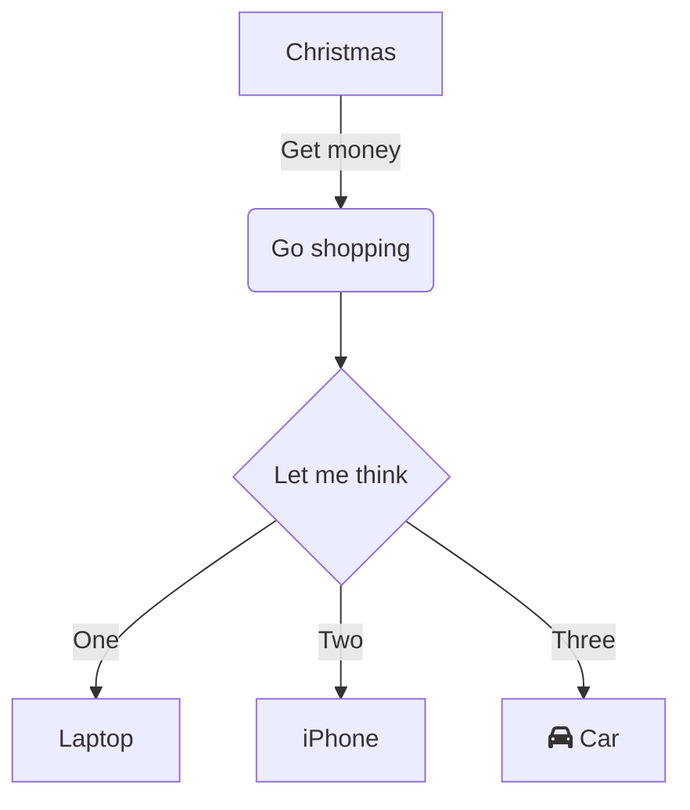

# Markdown Demo

This is a markdown file!

## API
API docs for the python thing or something?

[:test.py : api/api.md]: ###

> Some block quote text to be even cooler

Check it out, a mermaid diagram \o/

# Another Top Level

## With more sections
Like Odat does to screw things up
