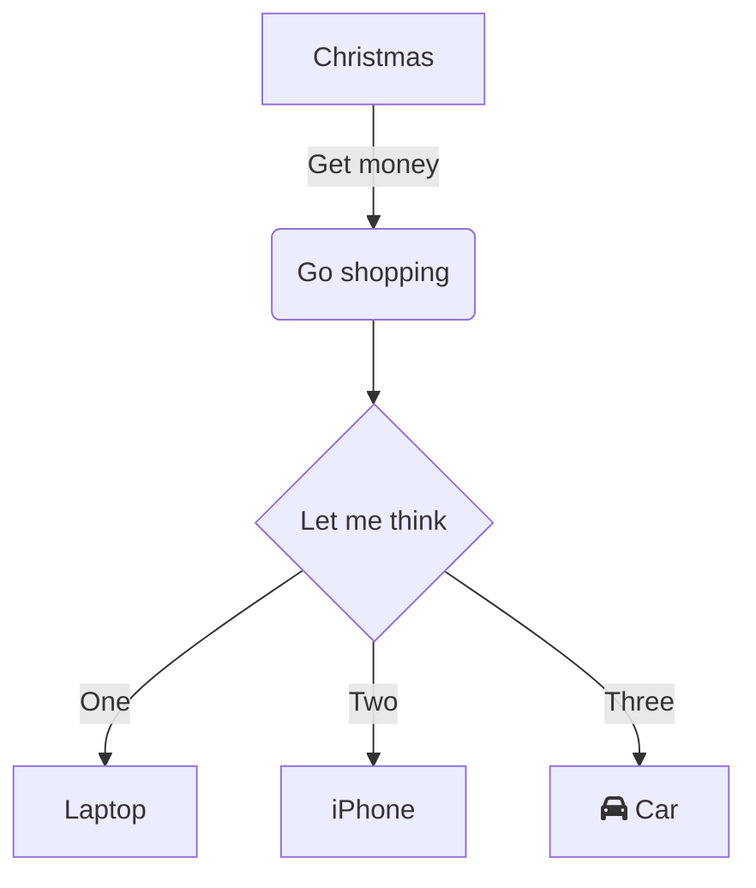

# Markdown Demo

This is a markdown file!

## API
API docs for the python thing or something?

[@@api](py-stuff/test.py)

> Some block quote text to be even cooler

Check it out, a mermaid diagram \o/

